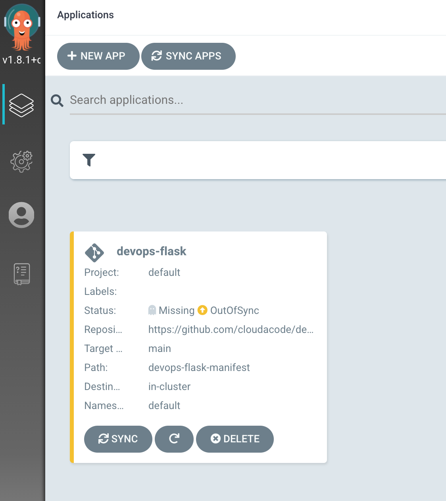
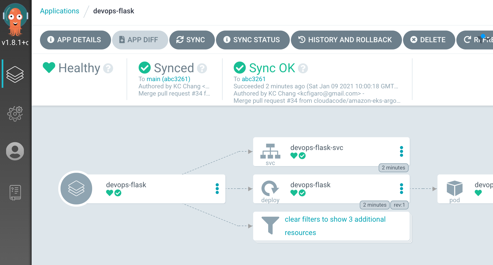
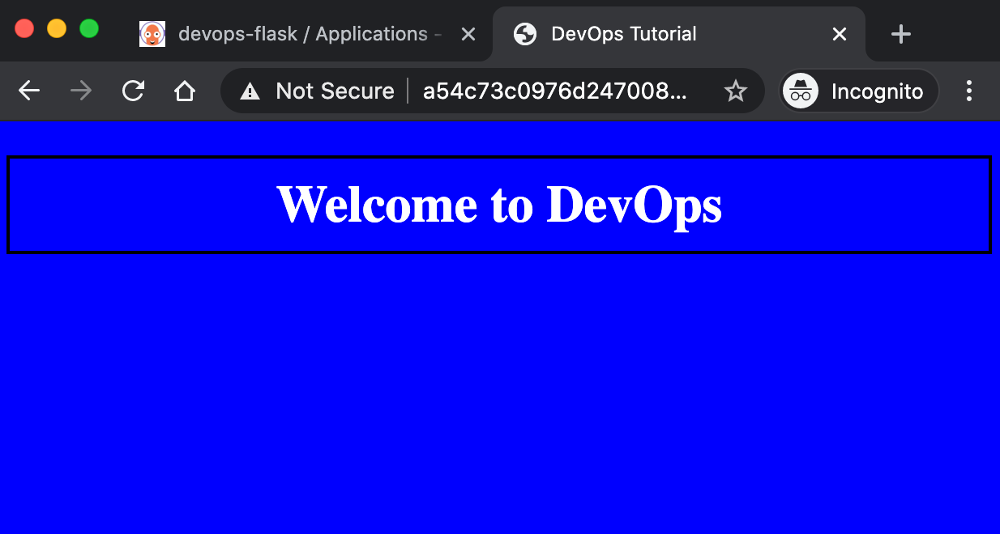

# EKS with ArgoCD Pipeline

__EKS로 컨테이너 환경 구성 및 ArgoCD 배포 환경 실습__

EKS로 대규모 컨테이너 운영 환경을 만들고 배포 관리툴(ArgoCD)을 설치해 관리 콘솔로 유연하게 서비스를 배포, 관리 효율화 

## 사전 준비 사항

### AWS CLI 설정

AWS CLI 설치: [관련 링크](https://docs.aws.amazon.com/cli/latest/userguide/install-cliv2.html)

AWS CLI 초기 설정: [관련 링크](https://docs.aws.amazon.com/cli/latest/userguide/cli-configure-quickstart.html)

!!! note 
    원활한 실습을 위해 IAM User 권한에 `AdministratorAccess` policy 부여

## Architecture


## 1. EKS 구성 하기

### IAM user for EKS
EKS는 Root User로 생성/접속하는 것을 보안상 권고하지 않으며 EKS을 관리하기 위한 권한(Kubernetes RBAC authorization)을 EKS를 생성한 IAM 엔터티(user 혹은 role)로 부터 할당을 시키기 때문에 IAM user 혹은 role를 사용중이지 않다면 필수로 IAM 엔터티를 생성하고 EKS 생성 역할을 부여 해야한다. 

https://docs.aws.amazon.com/eks/latest/userguide/create-cluster.html

사용중인 IAM 엔터티(유저, Role)가 있다면 eksctl 권한이 있는지 검토. 원활한 실습을 위해 **AdministratorAccess** policy 부여

Otherwise, create a IAM user with eksctl minimum policies.
https://eksctl.io/usage/minimum-iam-policies/

현재 세션의 IAM 엔터티 확인 방법
```bash
$ aws sts get-caller-identity
```

### Install eksctl and kubectl

EKS 생성을 위해 eksctl을 설치 하고 추후 kubernetes 관리를 위해 kubectl도 사전에 설치 필요: [설치 관련 링크](https://docs.aws.amazon.com/eks/latest/userguide/getting-started-eksctl.html)

### Deploy EKS Cluster

EKS 환경 배포
(참고: 실습 비용 절감을 위해 SPOT 인스턴스 사용)

```
$ eksctl create cluster -f ./eks-cluster-config.yml
```
EKS Cluster 구성 완료 까지 약 15분 소요

만약 CLI로 하고 싶다면 다음과 같이 수행
```
eksctl create cluster \
--name cloud-eks-01 \
--version 1.18 \
--region ap-northeast-2 \
--zones=ap-northeast-2a,ap-northeast-2c \
--nodegroup-name cloud-eks-workers \
--nodes 1 \
--nodes-min 1 \
--nodes-max 3 \
--with-oidc \
--managed \
--alb-ingress-access \
--spot \
--instance-types=c4.large,c5.large
```

### EKS Cluster 접속 확인

정상적인 output
```
[✔]  all EKS cluster resources for "cloud-eks-01" have been created
[ℹ]  nodegroup "cloud-eks-workers" has 1 node(s)
[ℹ]  node "ip-192-168-27-236.ap-northeast-2.compute.internal" is ready
[ℹ]  waiting for at least 1 node(s) to become ready in "cloud-eks-workers"
[ℹ]  nodegroup "cloud-eks-workers" has 1 node(s)
[ℹ]  node "ip-192-168-27-236.ap-northeast-2.compute.internal" is ready
[ℹ]  kubectl command should work with "/Users/kcchang/.kube/config", try 'kubectl get nodes'
[✔]  EKS cluster "cloud-eks-01" in "ap-northeast-2" region is ready
```

kubectl을 통해 추가된 node 확인
```
➜  ✗ kubectl get nodes
NAME                                                STATUS   ROLES    AGE   VERSION
ip-192-168-27-236.ap-northeast-2.compute.internal   Ready    <none>   19m   v1.18.9-eks-d1db3c
```

## 2. ArgoCD 연동

### ArgoCD CLI 설치
https://argoproj.github.io/argo-cd/cli_installation/

### ArgoCD 설치
https://argoproj.github.io/argo-cd/getting_started/

```
kubectl create namespace argocd
kubectl apply -n argocd -f https://raw.githubusercontent.com/argoproj/argo-cd/stable/manifests/install.yaml
```
This will create a new namespace, `argocd`, where Argo CD services and application resources will live.

### ArgoCD CLI 설치

Download the latest Argo CD version from [https://github.com/argoproj/argo-cd/releases/latest](https://github.com/argoproj/argo-cd/releases/latest). 

More detailed installation instructions can be found via the [CLI installation documentation](https://github.com/argoproj/argo-cd/blob/master/docs/cli_installation.md).

### ArgoCD Server 접속
In order to access server via URL, need to expose the Argo CD API server. Change the argocd-server service type to `LoadBalancer`:

```bash
kubectl patch svc argocd-server -n argocd -p '{"spec": {"type": "LoadBalancer"}}'
```
LB Endpoint를 노출 하더라도 도메인 등록 시간이 소요 되므로 브라우저를 통한 접근이 가능하기 까지는 약 5분 소요

Check the LB Endpoint

```bash
kubectl get -n argocd svc argocd-server    
NAME            TYPE           CLUSTER-IP       EXTERNAL-IP                                                                    PORT(S)                      AGE
argocd-server   LoadBalancer   10.100.143.242   a1521dde2ec114a4eb7fb04632cab058-1608723687.ap-northeast-2.elb.amazonaws.com   80:32511/TCP,443:31088/TCP   17m
```

Also available to get the external LB endpoint as a raw value:

```bash
kubectl get -n argocd svc argocd-server --output jsonpath='{.status.loadBalancer.ingress[0].hostname}'
```

초기 `admin` 패스워드 확인 
```bash
kubectl get pods -n argocd -l app.kubernetes.io/name=argocd-server -o name | cut -d'/' -f 2
```

브라우저를 통해 LB Endpoint 에 접속

!!! note
    SSL인증서 연동을 하지 않아 브라우저에서 사이트가 안전하지 않는다는 메시지가 발생하기 때문에 실습 때는 무시하고 진행한다.


### ArgoCD를 통해 App 배포

웹 콘솔에 접속후 __+ New App__ 클릭하여 신규 애플리케이션 생성

- GENERAL>
  - Application Name: cloud-flask 혹은 your application name
  - Project: default
  - Sync Policy: Manual
- SOURCE>
  - Repo URL: 본인의 github repo 주소, e.g., https://github.com/cloudacode/cloud-getting-started
  - Revision: main
  - Path: 쿠버 manifest를 정의한 디렉토리, e.g.,cloud-flask-manifest
- DESTINATION>
  - Cluster URL: https://kubernetes.default.svc
  - Namespace: default

__Create__ 진행 후

화면을 새로고침 하면 다음과 같이 앱이 하나 등록 되어 Sync가 아직 되지 않은 OutOfSync 상태로 확인 된다. Sync 정책을 Manual 로 하였기 때문에 초기에 OutOfSync 상태는 정상 이다.
 

__SYNC__ 수행 후

레포지토리 URL 이 올바르게 되어 있다면 문제 없이 sync가 완료되고 상세 페이지 역시 아래처럼 확인 가능하다 
 

__Service__(화면에서는 cloud-flask-svc)

를 선택하면 Hostnames 항목에 앱에 접속 가능한 LB URL이 생성 되었으며 웹 브라우져로 접속후 정상적으로 앱이 기동 되었는지 확인
 


## Clean Up
실습 완료 후 비용 절약을 위해 실습한 EKS 리소스를 정리
```
eksctl delete cluster --region=ap-northeast-2 --name=<your eks cluster name>
```

## Trobleshooting - EKS
https://aws.amazon.com/premiumsupport/knowledge-center/amazon-eks-cluster-access/

https://docs.aws.amazon.com/ko_kr/eks/latest/userguide/troubleshooting.html#unauthorized

## Reference
https://argoproj.github.io/argo-cd/getting_started
